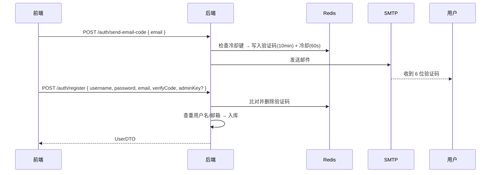

# 邮箱验证码（注册）功能说明

用户注册前须验证**邮箱所有权**：前端调用接口发送 6 位数字码到邮箱，用户在注册表单填写同一验证码；后端将验证码暂存于 **Redis**，校验通过并写入用户表后**一次性删除**该验证码。

---

## 功能流程



1. **发送验证码**：`POST /api/auth/send-email-code`（注意全局前缀 `/api`）  
   - 请求体：`{ "email": "user@example.com" }`（`SendEmailCodeRequest`，需合法邮箱格式）  
   - 成功：业务上返回 `Result` 表示已发送（具体文案见接口）  
   - 同一邮箱（忽略大小写）**60 秒内**不可重复发送（Redis 冷却键）

2. **注册**：`POST /api/auth/register`  
   - 请求体：`RegisterRequest`：用户名、密码、邮箱、**verifyCode**（必填）；可选 **adminKey**（值为 `yinbo` 时注册为管理员，生产环境须禁用或修改）  
   - 顺序：校验用户名不存在 → **校验并消费验证码** → 校验邮箱未注册 → 写入用户

验证码规则（见 `VerificationCodeServiceImpl`）：

| 项 | 值 |
|----|-----|
| 格式 | 6 位数字（前面补零） |
| 有效期 | 10 分钟 |
| 发送间隔 | 同一邮箱 60 秒内只能发一次 |
| Redis 键 | `yinbo:vc:email:{邮箱小写}`；冷却 `yinbo:vc:cd:email:{邮箱小写}` |
| 消费方式 | 注册成功校验后立即 `delete`，无论对错：错误则抛「验证码错误或已过期」 |

**依赖**：必须启动 **Redis**；`spring.data.redis` 须与本项目一致（默认 `database: 1`）。若 Redis 不可用，发信/校验均会失败。

---

## 后端配置

### 1. `application.yml` — `spring.mail`

邮件发送使用 Spring **`JavaMailSender`**。当配置了 **`spring.mail.host`** 时，会加载 `YinboJavaMailSenderConfiguration`：对 **`smtp.qq.com`** 会强制使用 **587 端口 + STARTTLS**，避免误用 465 导致 `SSLHandshakeException`。

推荐 QQ 邮箱示例（授权码在邮箱设置里生成，**不是登录密码**）：

```yaml
spring:
  mail:
    host: smtp.qq.com
    port: 587
    username: '你的QQ邮箱@qq.com'
    password: ${SPRING_MAIL_PASSWORD:此处不要写死到公开仓库}
    default-encoding: UTF-8
    properties:
      mail:
        smtp:
          auth: true
          starttls:
            enable: true
            required: true
          ssl:
            enable: false   # 587 为 STARTTLS，勿整链路 SSL
```

- **勿使用 465** 作为对外端口去模拟 587 行为；项目已通过自定义装配规避常见误配。  
- **敏感信息**：生产环境请用环境变量 **`SPRING_MAIL_PASSWORD`**（或部署平台密钥）覆盖 `password`，不要将真实授权码提交 Git。

### 2. 发件人显示名 — `yinbo.mail`

```yaml
yinbo:
  mail:
    from-name: 音波音乐   # 收件人看到的发件人名称
```

实际发件邮箱地址取自 `spring.mail.username`（`MimeMessageHelper#setFrom`）。

### 3. 未配置邮件时

若未配置 `spring.mail.host` 或未成功创建 `JavaMailSender`，调用发送验证码接口会收到类似：**「邮件服务未配置」**，需在 yml 中补全 SMTP。

---

## 接口与错误提示（摘要）

| 场景 | 表现 |
|------|------|
| 发送过快 | `发送过于频繁，请 60 秒后再试` |
| 未配邮件 / 无 Bean | `邮件服务未配置...` 或 `spring.mail.username 未配置` |
| SSL/TLS 误配（如 465） | 提示改用 **smtp.qq.com、587、STARTTLS** |
| SMTP 认证失败 | 提示检查 QQ SMTP、**授权码**、可用 `SPRING_MAIL_PASSWORD` |
| 注册时验证码错误/过期 | `邮箱验证码错误或已过期` |
| 注册时漏填验证码 | `请填写邮箱验证码`（校验层） |

实现类：`com.yinbo.service.impl.VerificationCodeServiceImpl`；发送失败时会**删除**已写入的验证码键，避免「邮件没发出却占着码」。

---

## 前端对接（用户端）

- 文件：`YinBo-Client/src/views/Login.vue`（注册 Tab）、`YinBo-Client/src/api/index.ts`（`userApi.sendEmailCode`）  
- 发送：`POST /auth/send-email-code`，body `{ email }`  
- 注册：`POST /auth/register`，body 含 `verifyCode`  

须保证 `VITE_API_BASE_URL` 指向后端（含 `/api` 前缀，与 `context-path` 一致）。

---

## 安全与运维建议

1. 验证码仅用于「证明邮箱可用」，**不能**替代登录二次验证。  
2. 控制发信频率（已实现 60s 冷却）；若暴露公网，建议再配合 WAF / 限流 / 图形验证码（当前未做）。  
3. **adminKey**：`RegisterRequest.adminKey == "yinbo"` 可注册管理员，务必在生产修改逻辑或改为后台邀请制。  
4. 定期轮换邮箱授权码与 `SPRING_MAIL_PASSWORD`。

---

## 相关源码索引

| 说明 | 路径 |
|------|------|
| 发送 / 注册入口 | `AuthController` → `/auth/send-email-code`、`/auth/register` |
| 验证码逻辑 | `VerificationCodeService` / `VerificationCodeServiceImpl` |
| 注册事务 | `UserServiceImpl#registerWithVerification` |
| 请求 DTO | `SendEmailCodeRequest`、`RegisterRequest` |
| QQ 邮箱 SMTP 装配 | `YinboJavaMailSenderConfiguration` |
| 发件显示名 | `YinboMailDisplayProperties`（`yinbo.mail.from-name`） |
